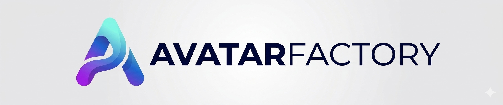

<p align="center">
  
</p>

# AvatarFactory

**AvatarFactory** is a *Persona Factory* for social platforms: it helps you **design, simulate, evaluate, and evolve** social personas (avatars) across different platforms, so you can build long-term attention and trust—preparing for sustainable lead generation and future monetization.

> Focus: **persona building & learning**, not risky "full automation".
> Default mode: **human-in-the-loop** publishing and engagement for compliance.

---

## Why AvatarFactory

Building a strong persona is not just "writing posts". It's an iterative loop:

1. Define a persona with clear positioning and boundaries
2. Create consistent, platform-native content at scale
3. Learn from feedback signals (saves, comments, follows, DMs)
4. Evolve the persona and content pillars over time
5. Gradually build trust and conversion readiness

AvatarFactory turns this into an **experiment-driven workflow**.

---

## Core Goals

- **Persona Assetization**: represent a persona as a structured, versioned configuration (not a one-line bio).
- **Cross-Platform Adaptation**: translate one persona into platform-native styles (e.g., Xiaohongshu vs. Twitter/X vs. Bluesky).
- **Offline Simulation**: simulate "what could happen after posting" (expected engagement, comment topics, risk flags) before going live.
- **Experiment & Learning Loop**: run experiments, collect feedback, and update persona/content strategies with traceability.
- **Monetization Readiness (Later)**: mine recurring demands from interactions to inform future offers/products—without locking into a product too early.

---

## Features

### Agent System
- **PersonaAgent** - Persona CRUD, versioning, optimization
- **ContentAgent** - Multi-variant generation with hot-topic integration
- **TopicAgent** - Discover hot topics and analyze trends from social platforms
- **ReviewAgent** - 4-dimension scoring (persona consistency, platform fit, compliance, engagement)
- **SimulationAgent** - Engagement prediction and comment scripts
- **RecommendationAgent** - Generate persona recommendations from trending data
- **EvolutionAgent** - Feedback analysis, evolution suggestions, approval workflows
- **ProactiveOrchestrator** - Scheduled tasks, automatic trend scanning

### Platform Connectors

| Platform | Auth Method | Publish | Fetch | Topic Discovery |
|----------|-------------|---------|-------|-----------------|
| Bluesky | AT Protocol (app password) | Yes | Yes | Yes |
| Twitter/X | API v2 (OAuth) | Yes | Yes | Yes |
| Xiaohongshu (小红书) | Cookie + xhs signing | Yes | Yes | Yes |
| LinkedIn | OAuth 2.0 | Yes | Yes | No |
| Instagram | Graph API | Yes | Yes | No |
| Threads | Graph API | Yes | Yes | No |
| Weibo (微博) | Cookie-based | Yes | Yes | Yes |
| Mastodon | OAuth 2.0 | Yes | Yes | Yes |
| Toutiao (头条) | Cookie-based | Yes | Yes | Yes |
| Zhihu (知乎) | Cookie-based | Yes | Yes | Yes |

### Search Connectors
- **Brave Search** - Web search for trend discovery
- **Bing Search** - Web search with Azure integration

### Notifications & Callbacks
- **WeChat Work (企业微信)** - Webhook-based team notifications (text, markdown, news card)
- **Webhook Notifier** - Multi-format push notifications (Slack, Discord, Feishu, WeChat Work, generic)
- **Console Notifier** - Local console output for development

### Content Adapters

Platform-specific content formatting and validation for each connector (character limits, hashtag rules, image requirements, etc.):

Bluesky, Twitter, Xiaohongshu, LinkedIn, Instagram, Threads, Weibo, Mastodon, Toutiao, Zhihu

### Service & Deployment
- **FastAPI REST API** - Production-ready HTTP service with auth middleware
- **Background Scheduler** - APScheduler-based task automation
- **Docker Support** - Containerized deployment with docker-compose
- **Multi-Tenancy** - Tenant-isolated knowledge bases and connector configs

### Web Interfaces
- **Web Admin** (Astro) - Management dashboard with the following features:
  - **Dashboard** - Overview with personas, content, and task statistics
  - **Chat** - Interactive conversation interface with AI service
    - Real-time message exchange with Markdown rendering
    - Persona selector for contextual conversations
    - Quick suggestion chips for common queries
    - Expandable metadata for response details
  - **Personas** - Persona management (create, view, edit, delete)
  - **Connectors** - Platform connector configuration and testing
  - **Schedulers** - Task scheduling and management
  - **Topics** - Hot topic discovery and trend analysis
  - **Contents** - Content library with status filtering
  - **Statistics** - Analytics and performance metrics
- **Web Journal** (Astro) - Public content journal
- **Streamlit Dashboard** - Visual analytics (topology, personas, scheduler, content, topics, chat)

### Video Generation
- **Azure TTS** - High-quality text-to-speech
- **Edge TTS** - Free Microsoft Edge TTS (no API key required)
- **Azure Avatar** - AI digital human video generation
- **Video Composer** - Combine audio and images into videos

---

## Getting Started

### Installation

**Recommended: Using Virtual Environment (venv)**

Windows:
```powershell
# PowerShell (recommended)
.\scripts\setup_venv.ps1

# Or CMD
scripts\setup_venv.bat
```

macOS/Linux:
```bash
chmod +x scripts/setup_venv.sh
./scripts/setup_venv.sh
```

The script will create a virtual environment, install dependencies, setup AvatarFactory, and verify installation.

---

**Alternative: Direct install**

```bash
git clone https://github.com/EldonZhao/AvatarFactory.git
cd AvatarFactory

pip install -r requirements.txt
pip install -e .

# For service deployment
pip install -e ".[service]"
```

### Configuration

1. Create a `.env` file from the example:
```bash
cp .env.example .env
```

2. Configure your LLM provider:

**Option A: Anthropic Claude (Default)**
```bash
AVATARFACTORY_LLM_PROVIDER=anthropic
ANTHROPIC_API_KEY=your_api_key_here
```

**Option B: Azure OpenAI**
```bash
AVATARFACTORY_LLM_PROVIDER=azure_openai
AVATARFACTORY_MODEL=gpt-4
AZURE_OPENAI_API_KEY=your_key
AZURE_OPENAI_ENDPOINT=https://your-resource.openai.azure.com/
AZURE_OPENAI_API_VERSION=2024-02-15-preview
```

**Option C: OpenAI**
```bash
AVATARFACTORY_LLM_PROVIDER=openai
AVATARFACTORY_MODEL=gpt-4-turbo-preview
OPENAI_API_KEY=your_key
```

3. (Optional) Configure platform connectors:

```bash
# Bluesky
BLUESKY_USERNAME=your.handle.bsky.social
BLUESKY_PASSWORD=your-app-password

# Xiaohongshu
XIAOHONGSHU_COOKIE=your_cookie_string
XIAOHONGSHU_USER_ID=your_user_id

# LinkedIn
LINKEDIN_ACCESS_TOKEN=your_oauth2_token
```

4. (Optional) Configure notifications callback:

```bash
# WeChat Work webhook
AVATARFACTORY_WEBHOOK_URL=https://qyapi.weixin.qq.com/cgi-bin/webhook/send?key=YOUR_KEY
AVATARFACTORY_WEBHOOK_FORMAT=wecom

# Or Slack / Discord / Feishu
AVATARFACTORY_WEBHOOK_FORMAT=slack
```

### Quick Start

**Interactive Chat (Recommended):**
```bash
avatarfactory chat
```

Then talk naturally:
```
You: Create a persona for an AI tools reviewer targeting product managers
You: Generate content about Notion vs Obsidian comparison
You: Discover trending topics on Bluesky
```

**Quick Commands:**
```bash
# Create a persona
avatarfactory create-persona "AI tools expert for product managers"

# Generate content
avatarfactory generate "Notion vs Obsidian comparison"

# Discover trending content
avatarfactory discover --platform bluesky --limit 20

# List personas
avatarfactory list-personas

# Show content
avatarfactory show-content <content_id>

# Publish draft
avatarfactory publish-draft <content_id> --platform bluesky

# Get content inspiration from trends
avatarfactory inspire <persona_id> --platform bluesky

# Show stats
avatarfactory stats
```

---

## CLI Reference

```bash
# Chat & Core
avatarfactory chat [--persona PERSONA_ID]          # Interactive mode
avatarfactory create-persona "description"          # Create persona
avatarfactory generate "topic" [--variants N]       # Generate content
avatarfactory list-personas                         # List all personas
avatarfactory delete-persona <id> [--force]         # Delete persona
avatarfactory list-content [--status draft]         # List content
avatarfactory show-content <id>                     # Show content details
avatarfactory publish-draft <id> --platform P       # Publish to platform

# Platform Operations
avatarfactory connect <platform>                    # Test connection
avatarfactory fetch <platform> [--limit N]          # Fetch trending content
avatarfactory publish <platform> "content"          # Direct publish
avatarfactory discover <platform> [--limit N]       # Discover & analyze trends
avatarfactory inspire <persona_id>                  # Content inspiration

# Scheduler
avatarfactory daemon start|status|stop              # Background scheduler
avatarfactory schedule list|add|remove|run          # Task management
avatarfactory queue add|list|remove                 # Publish queue

# Service
avatarfactory serve [--port 8000]                   # Start API server
avatarfactory dashboard [--port 8501]               # Start Streamlit dashboard

# Video
avatarfactory video generate [--type talking_head]  # Generate video
avatarfactory video list-voices [--locale zh-CN]    # List TTS voices

# Utilities
avatarfactory stats                                 # Knowledge base stats
avatarfactory version                               # Version info
avatarfactory migrate-storage [--dry-run]           # Migrate storage
```

---

## Service Deployment

### Run as HTTP Service

```bash
# Start the API server
avatarfactory serve --host 0.0.0.0 --port 8000

# Start with Streamlit dashboard
avatarfactory serve --dashboard

# Run scheduler only
avatarfactory serve --mode scheduler
```

### API Endpoints

**System**
- `GET /health` - Health check
- `GET /topology` - System topology visualization
- `GET /connectors/status` - All connector status

**Chat**
- `POST /chat` - Process chat message

**Personas**
- `GET /personas` - List all personas
- `GET /personas/{id}` - Get persona details
- `POST /personas` - Create persona
- `DELETE /personas/{id}` - Delete persona

**Content**
- `POST /content/generate` - Generate content
- `GET /content` - List content
- `GET /content/{id}` - Get content details
- `GET /content/{id}/view` - Rendered content view
- `GET /content/{id}/image` - Content image
- `GET /content/{id}/images` - List content images

**Scheduler**
- `GET /scheduler/status` - Scheduler status
- `GET /scheduler/tasks` - List scheduled tasks
- `POST /scheduler/tasks` - Create task
- `POST /scheduler/tasks/{id}/run` - Run task now
- `DELETE /scheduler/tasks/{persona_id}` - Remove tasks

**Connectors**
- `GET /api/connectors/` - List all connectors
- `GET /api/connectors/{platform}` - Connector details
- `PUT /api/connectors/{platform}` - Update config
- `POST /api/connectors/{platform}/test` - Test connection
- `DELETE /api/connectors/{platform}` - Remove connector

**Evolution**
- `POST /personas/{id}/evolution/analyze` - Analyze for evolution
- `POST /personas/{id}/evolution/suggest` - Generate suggestions
- `GET /personas/{id}/evolution/suggestions` - Get suggestions
- `POST /personas/{id}/evolution/apply` - Apply evolution
- `POST /personas/{id}/evolution/rollback` - Rollback
- `GET /personas/{id}/evolution/history` - Evolution history

**Agent Config**
- `GET /personas/{id}/agents/{type}/config` - Get agent config
- `PUT /personas/{id}/agents/{type}/config` - Update agent config

### Docker Deployment

```bash
docker-compose up -d
docker-compose logs -f
docker-compose down
```

---

## Architecture

```
CLI (chat / commands) / FastAPI Service / Web Admin (Astro)
    ↓
ProactiveOrchestrator (intent routing + scheduled tasks)
    ├→ PersonaAgent         (persona CRUD, versioning)
    ├→ ContentAgent         (multi-variant generation + hot-topic integration)
    ├→ TopicAgent           (hot topic mining via search & platform connectors)
    ├→ ReviewAgent          (4-dimension scoring)
    ├→ SimulationAgent      (engagement prediction)
    ├→ RecommendationAgent  (persona recommendations from trends)
    ├→ EvolutionAgent       (feedback → evolution suggestions → apply/rollback)
    └→ KnowledgeBase        (file-based YAML/JSON persistence)

Platform Connectors (via ConnectorRegistry)
    ├→ BlueskyConnector     (AT Protocol)
    ├→ TwitterConnector     (API v2)
    ├→ XiaohongshuConnector (cookie + xhs signing)
    ├→ LinkedInConnector    (OAuth 2.0)
    ├→ InstagramConnector   (Graph API)
    ├→ ThreadsConnector     (Graph API)
    ├→ WeiboConnector       (cookie-based)
    ├→ MastodonConnector    (OAuth 2.0)
    ├→ ToutiaoConnector     (cookie-based)
    ├→ ZhihuConnector       (cookie-based)
    ├→ BraveSearchConnector (search API)
    └→ BingSearchConnector  (Azure search API)

Content Adapters (platform-specific formatting & validation)
    └→ One adapter per platform (character limits, hashtags, images, etc.)

Notifications & Callbacks
    ├→ WeComConnector       (WeChat Work webhook: text, markdown, news card)
    ├→ WebhookNotifier      (Slack, Discord, Feishu, WeChat Work, generic)
    └→ ConsoleNotifier      (development output)
```

---

## Project Structure

```
avatarfactory/
├── agents/              # AI agents
│   ├── base.py          # BaseAgent abstract class
│   ├── persona.py       # PersonaAgent (persona CRUD, versioning)
│   ├── content.py       # ContentAgent (content generation)
│   ├── review.py        # ReviewAgent (4-dimension scoring)
│   ├── simulation.py    # SimulationAgent (engagement prediction)
│   ├── recommendation.py # RecommendationAgent (trend-based recommendations)
│   ├── evolution.py     # EvolutionAgent (persona evolution)
│   ├── orchestrator.py  # OrchestratorAgent (intent routing)
│   └── proactive_orchestrator.py  # ProactiveOrchestrator (scheduling)
├── connectors/          # Platform connectors
│   ├── base.py          # BasePlatformConnector
│   ├── registry.py      # ConnectorRegistry (decorator-based)
│   ├── bluesky.py       # Bluesky (AT Protocol)
│   ├── twitter.py       # Twitter/X (API v2)
│   ├── xiaohongshu.py   # Xiaohongshu (小红书)
│   ├── linkedin.py      # LinkedIn (OAuth 2.0)
│   ├── instagram.py     # Instagram (Graph API)
│   ├── threads.py       # Threads (Graph API)
│   ├── weibo.py         # Weibo (微博)
│   ├── mastodon.py      # Mastodon (OAuth 2.0)
│   ├── toutiao.py       # Toutiao (头条)
│   ├── zhihu.py         # Zhihu (知乎)
│   ├── brave_search.py  # Brave Search
│   ├── bing_search.py   # Bing Search
│   └── wecom.py         # WeChat Work (notification callback)
├── adapters/            # Platform content adapters
│   ├── base.py          # BasePlatformAdapter
│   └── *.py             # One adapter per platform
├── core/                # Core infrastructure
│   ├── knowledges.py    # File-based YAML/JSON storage
│   ├── llm_provider.py  # LLM abstraction (Anthropic, OpenAI, Azure)
│   ├── agent_config.py  # Agent configuration management
│   ├── credentials.py   # Credential handling
│   ├── tenant.py        # Multi-tenant support
│   └── tenant_kb.py     # Tenant-specific knowledge base
├── models/              # Pydantic data models
│   └── schemas.py       # All schemas (Persona, Content, AgentMessage, etc.)
├── notifications/       # Notification system (callbacks)
│   ├── base.py          # NotificationProvider, NotificationManager
│   ├── webhook.py       # WebhookNotifier (Slack, Discord, Feishu, WeChat Work)
│   └── console.py       # ConsoleNotifier
├── scheduler/           # Task scheduling
│   ├── engine.py        # APScheduler engine
│   └── tasks.py         # TaskRegistry (decorator-based)
├── service/             # FastAPI service
│   └── app.py           # REST API (33+ endpoints)
├── middleware/           # HTTP middleware
│   └── auth.py          # Authentication
├── dashboard/           # Streamlit dashboard
│   ├── Dashboard.py     # Main entry
│   └── pages/           # Topology, Personas, Scheduler, Content, Topics, Chat
├── video/               # Video generation
│   ├── azure_tts.py     # Azure TTS
│   ├── edge_tts.py      # Edge TTS (free)
│   ├── azure_avatar.py  # Azure Avatar
│   └── composer.py      # Video composer
├── utils/               # Utility helpers
└── cli.py               # Typer CLI with Rich terminal UI

web-admin/               # Astro web admin (personas, content, connectors, scheduler)
web-journal/             # Astro public journal

knowledges/              # User data storage (default)
├── personas/            # Persona configurations
├── content_library/     # Generated content
├── experiments/         # Experiment data
├── platform_rules/      # Platform-specific rules
├── recommendations/     # Recommendation data
├── scheduler/           # Scheduler state & tasks
├── user_feedback/       # User feedback records
└── videos/              # Generated videos
```

---

## Current Status

**Implemented:**
- Multi-agent system with 8 specialized agents
- Persona creation, versioning, and evolution
- Content generation with multi-variant and hot-topic support
- 4-dimension review scoring system
- 10 platform connectors + 2 search connectors
- Platform-specific content adapters (10 platforms)
- Notification callbacks (WeChat Work, Slack, Discord, Feishu)
- Scheduled task automation (APScheduler)
- FastAPI REST API (33+ endpoints) with auth middleware
- Multi-tenancy support
- Docker deployment
- Video generation (Azure TTS, Edge TTS, Azure Avatar)
- Streamlit analytics dashboard
- Astro web admin and journal interfaces

---

## Contributing

Contributions are welcome! Please read our [Contributing Guide](.github/CONTRIBUTING.md) to get started.

- [Code of Conduct](.github/CODE_OF_CONDUCT.md)
- [Security Policy](.github/SECURITY.md)
- [Support & Troubleshooting](.github/SUPPORT.md)

---

## Documentation

| Guide | Description |
|-------|-------------|
| [Getting Started](docs/getting-started.md) | Installation, configuration, first run |
| [Configuration](docs/configuration.md) | LLM providers, connectors, environment variables |
| [Architecture](docs/architecture.md) | Multi-agent system design |
| [API Reference](docs/api-reference.md) | REST API endpoints |
| [Troubleshooting](docs/troubleshooting.md) | Common issues and solutions |
| [Connectors](docs/connectors/README.md) | Platform-specific setup guides |
| [Azure Deployment](docs/deployment/azure.md) | Deploy to Azure Web App |
| [Docker Deployment](docs/deployment/docker.md) | Containerized deployment |
| [Changelog](docs/changelog/v0.2.0.md) | Version history and migration guides |

---

## License

MIT License - see [LICENSE](LICENSE) for details.
