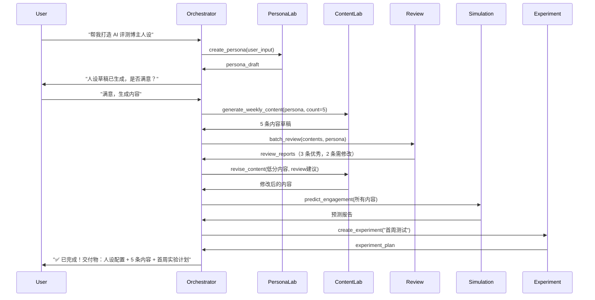
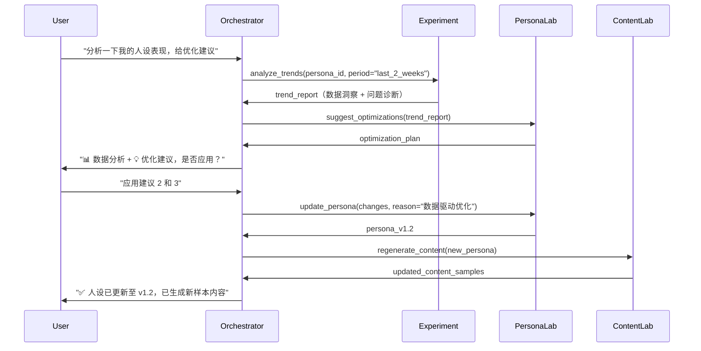

# Architecture

AvatarFactory 多 Agent 系统架构设计文档。

> **Version**: v1.0 | **Date**: 2026-02-01

---

## 系统架构概览

### 1.1 整体架构图

```
┌─────────────────────────────────────────────────────────────┐
│                     用户交互层 (User Interface)                │
│  CLI / Web UI / API - 用户配置人设、下达任务、查看结果        │
└────────────────────┬────────────────────────────────────────┘
                     │
┌────────────────────▼────────────────────────────────────────┐
│              主控 Agent (Orchestrator Agent)                 │
│  • 理解用户意图                                               │
│  • 制定执行计划                                               │
│  • 调度 Sub-Agents                                           │
│  • 汇总结果并反馈用户                                         │
└────────────────────┬────────────────────────────────────────┘
                     │
        ┌────────────┼────────────┬────────────┬──────────┐
        │            │            │            │          │
┌───────▼──────┐ ┌──▼─────┐ ┌───▼──────┐ ┌───▼─────┐ ┌─▼──────┐
│ Persona Lab  │ │Content │ │Simulation│ │ Review  │ │Experiment│
│    Agent     │ │  Lab   │ │   Lab    │ │  Agent  │ │  Agent  │
│              │ │ Agent  │ │  Agent   │ │         │ │         │
└──────┬───────┘ └───┬────┘ └────┬─────┘ └────┬────┘ └────┬────┘
       │             │           │            │           │
       └─────────────┴───────────┴────────────┴───────────┘
                                 │
                    ┌────────────▼────────────┐
                    │   共享知识库 & 记忆层    │
                    │ • 人设配置 (versioned)  │
                    │ • 历史实验数据          │
                    │ • 平台规则库            │
                    │ • 用户反馈循环          │
                    └─────────────────────────┘
```

### 1.2 核心设计理念

- **人设即资产**：结构化、版本化管理人设配置
- **实验驱动**：每次发布都是一次实验，持续学习优化
- **人在回路**：关键决策点必须人工确认，避免失控
- **合规优先**：内置风险审核机制，不帮用户钻空子
- **平台中立**：通过 Adapter 模式支持多平台

---

## 用户交互设计

### 2.1 三种交互模式

#### 模式 1：对话式（推荐新手）

**适用场景**：首次使用、探索功能、快速创建

**交互示例**：
```
User: 帮我打造一个 AI 评测博主人设

Agent: 好的！我需要了解几个关键信息：
       1. 目标平台？（小红书/抖音/Twitter/知乎）
       2. 核心受众？（开发者/产品经理/普通用户）
       3. 内容调性？（专业严谨/轻松有趣/实用干货）

User: 小红书，产品经理，实用干货

Agent: [Persona Lab Agent 启动...]
       ✅ 已生成人设草稿
       📝 身份定位：AI 工具实战派 | 帮产品经理找好用的 AI
       🎯 内容支柱：工具评测、使用技巧、场景案例
       🗣️ 语气风格：直接、接地气、有数据支撑

       是否满意？（满意/需要调整）
```

#### 模式 2：配置式（推荐专业用户）

**适用场景**：已有清晰人设规划、批量操作

**交互示例**：
```yaml
# user_input.yaml
persona:
  identity: "AI 工具评测专家"
  target_audience: "产品经理、运营"
  platforms: ["xiaohongshu"]
  content_pillars:
    - "AI 工具横向对比"
    - "提示词技巧"
    - "自动化工作流"
  voice: "专业但不装，有数据有案例"

# 命令行
$ avatarfactory create-persona --config user_input.yaml
```

#### 模式 3：渐进式（推荐迭代优化）

**适用场景**：已运营一段时间，基于数据优化

**交互示例**：
```
User: 我的人设已经运营 2 周了，想优化一下

Agent: [Experiment Agent 分析中...]
       📊 过去 2 周数据：
       • 最受欢迎内容类型：工具对比（平均互动 230）
       • 表现欠佳内容：纯理论讲解（平均互动 45）
       • 用户高频问题："哪个工具适合我？"

       [Persona Lab Agent 建议...]
       💡 优化建议：
       1. 增加"场景选型指南"内容支柱
       2. 减少理论科普，增加实战案例
       3. 增加互动环节"评论区诊断需求"

       是否应用这些优化？
```

### 2.2 用户旅程图

```
阶段 1: 人设创建
  User: 描述想法 → Orchestrator: 理解意图 → Persona Lab: 生成草稿
  → User: 确认/调整 → 保存人设 v1.0

阶段 2: 内容生成
  User: "生成本周内容" → Content Lab: 批量生成 → Review: 审核
  → Simulation: 预测效果 → User: 选择发布哪几条

阶段 3: 发布与追踪
  User: 手动发布到平台 → 记录实际数据 → Experiment: 追踪实验

阶段 4: 复盘与优化
  周末: Experiment Agent 自动生成周报 → User: 查看洞察
  → 决定下周策略 → Persona Lab: 更新人设（如需要）
```

---

## Sub-Agent 职责详解

### 3.1 Orchestrator Agent（主控 Agent）

**核心职责**：全局调度和用户对话

**能力模块**：
1. **意图理解**：
   - 解析用户自然语言指令
   - 识别任务类型（创建人设 / 生成内容 / 数据分析 / 优化策略）

2. **任务编排**：
   ```python
   # 示例：用户说"帮我打造一个人设"
   plan = [
       {"agent": "PersonaLabAgent", "task": "create_persona_draft"},
       {"agent": "ContentLabAgent", "task": "generate_sample_content", "count": 5},
       {"agent": "ReviewAgent", "task": "check_compliance"},
       {"agent": "SimulationLabAgent", "task": "predict_performance"},
   ]
   ```

3. **对话管理**：
   - 在关键决策点暂停并询问用户
   - 实时反馈 Sub-Agents 的工作进度
   - 汇总结果并用人类语言解释

**API 接口**：
```python
class OrchestratorAgent:
    def understand_intent(self, user_input: str) -> Intent
    def create_execution_plan(self, intent: Intent) -> Plan
    def execute_plan(self, plan: Plan) -> Result
    def communicate_with_user(self, message: str, options: list = None) -> UserResponse
```

---

### 3.2 Persona Lab Agent（人设实验室 Agent）

**核心职责**：人设定义、版本管理、迭代优化

**能力模块**：

#### 1. 人设生成
输入：用户的粗略描述
```
"想做一个 AI 工具评测博主，目标受众是产品经理"
```

输出：结构化人设配置
```yaml
identity:
  name: "AI 工具实战派"
  tagline: "帮产品经理挑选最合适的 AI 工具"
  expertise: ["AI 工具评测", "效率提升", "产品场景"]

target_audience:
  primary: "互联网产品经理（1-5 年经验）"
  pain_points:
    - "工具太多不知如何选"
    - "担心学习成本"
    - "不确定 ROI"
  goals:
    - "提升工作效率"
    - "掌握 AI 趋势"
    - "团队降本增效"

voice_style:
  tone: "专业但接地气"
  language_patterns:
    - "用数据说话"
    - "场景化举例"
    - "避免术语堆砌"
  emoji_usage: "适度（突出重点）"

content_pillars:
  - name: "工具横向对比"
    frequency: "每周 2 条"
  - name: "实战技巧分享"
    frequency: "每周 1 条"
  - name: "场景化案例"
    frequency: "每周 1 条"
  - name: "行业趋势观察"
    frequency: "每月 2 条"

boundaries:
  avoid:
    - "过度营销"
    - "虚假评测"
    - "贬低竞品"
  compliance:
    - "标注利益相关"
    - "数据来源可追溯"
```

#### 2. 版本管理
```python
{
    "version": "v1.2",
    "timestamp": "2024-02-01T10:00:00Z",
    "changes": [
        "新增内容支柱：场景化案例",
        "调整语气：减少专业术语，增加实战案例"
    ],
    "reason": "前 2 周数据显示用户更喜欢实战内容",
    "expected_impact": "预期互动率提升 15-20%",
    "author": "user_001",
    "approved": true
}
```

#### 3. 人设验证
- **内部一致性检查**：身份 vs 内容支柱是否匹配
- **市场定位检查**：和竞品的差异点是否清晰
- **可持续性检查**：内容能否长期产出

**API 接口**：
```python
class PersonaLabAgent:
    def create_persona(self, user_description: str) -> Persona
    def update_persona(self, persona_id: str, changes: dict, reason: str) -> Persona
    def validate_persona(self, persona: Persona) -> ValidationReport
    def compare_versions(self, v1: str, v2: str) -> ComparisonReport
    def get_persona_history(self, persona_id: str) -> list[PersonaVersion]
```

---

### 3.3 Content Lab Agent（内容实验室 Agent）

**核心职责**：内容生成、多变体创作、风格一致性

**能力模块**：

#### 1. 模板化生成
```python
# 根据内容支柱选择模板
templates = {
    "工具对比": ["AB 对比法", "多维评分法", "场景适配法"],
    "实战技巧": ["3 步教程", "避坑指南", "效率提升清单"],
    "场景案例": ["问题-方案-效果", "before/after 对比"]
}

# 生成示例
topic = "Notion AI vs Obsidian + ChatGPT，产品经理如何选？"
template = "AB 对比法"

output = {
    "title": "产品经理该选 Notion AI 还是 Obsidian？我测了 2 周",
    "structure": [
        "钩子：你是否也在这两个工具间纠结？",
        "对比维度：价格、学习成本、协作能力、AI 能力",
        "实测数据：表格对比 + 截图",
        "选型建议：不同场景推荐",
        "CTA：评论区说说你的选择"
    ],
    "style_constraints": {
        "tone": "客观中立，有倾向但不强推",
        "data_requirement": "至少 3 个对比维度有数据支撑",
        "emoji_density": "每 50 字最多 1 个"
    }
}
```

#### 2. 多变体生成
```python
# 同一主题生成 3 个版本，供用户选择
variants = [
    {
        "title": "产品经理该选 Notion AI 还是 Obsidian？我测了 2 周",
        "angle": "横向对比型",
        "hook": "测试驱动",
        "predicted_engagement": "中等偏上"
    },
    {
        "title": "别被 Notion AI 骗了！产品经理真正需要的是...",
        "angle": "反常识型",
        "hook": "打破认知",
        "predicted_engagement": "高（有争议风险）"
    },
    {
        "title": "花了 2000 块，我终于找到了产品经理最佳笔记方案",
        "angle": "个人故事型",
        "hook": "成本共鸣",
        "predicted_engagement": "中等"
    }
]
```

#### 3. 平台适配
```python
# 同一内容适配不同平台
base_content = "工具对比：Notion AI vs Obsidian"

adaptations = {
    "xiaohongshu": {
        "title_max_length": 20,
        "emoji_required": True,
        "image_count": "3-9",
        "hashtag_count": "3-5",
        "tone": "轻松、视觉化",
        "structure": "图片 + 短文案"
    },
    "zhihu": {
        "title_format": "问题式",
        "min_length": 800,
        "data_depth": "深度分析",
        "tone": "专业、逻辑严密",
        "structure": "长文 + 数据图表"
    },
    "twitter": {
        "max_length": 280,
        "thread_enabled": True,
        "tone": "简洁、有观点",
        "structure": "thread（5-7 条）"
    }
}
```

**API 接口**：
```python
class ContentLabAgent:
    def generate_content(
        self,
        persona: Persona,
        pillar: str,
        topic: str,
        template: str = None
    ) -> Content

    def generate_variants(
        self,
        base_topic: str,
        count: int = 3
    ) -> list[Content]

    def adapt_to_platform(
        self,
        content: Content,
        platform: str
    ) -> Content

    def batch_generate(
        self,
        persona: Persona,
        weekly_plan: dict
    ) -> list[Content]
```

---

### 3.4 Review Agent（审核 Agent）

**核心职责**：合规检查、人设一致性评分、风险预警

**能力模块**：

#### 1. 多维度评分
```python
review_result = {
    "persona_consistency": {
        "score": 85,
        "issues": ["语气略显生硬，建议增加 1-2 个场景化例子"],
        "strengths": ["数据支撑充分", "话题符合人设定位"]
    },

    "platform_fit": {
        "score": 90,
        "platform": "xiaohongshu",
        "issues": ["标题可以更口语化", "建议增加 emoji"],
        "strengths": ["图片搭配合理", "长度适中"]
    },

    "compliance": {
        "score": 100,
        "risk_level": "low",
        "checks": {
            "sensitive_words": "pass",
            "misleading_claims": "pass",
            "spam_patterns": "pass",
            "copyright": "pass"
        }
    },

    "engagement_potential": {
        "score": 78,
        "prediction": "中等偏上",
        "suggestions": [
            "开头钩子可以更强（当前 6/10，建议 8/10）",
            "CTA 不够明确，建议加互动问题"
        ]
    }
}
```

#### 2. 风险检测规则库
```python
risk_categories = {
    "合规风险": [
        "敏感词检测（政治、色情、暴力）",
        "虚假宣传（'最好'、'第一'等绝对化表述）",
        "诱导分享/关注（违规引流话术）",
        "医疗/金融相关未标注免责声明"
    ],

    "人设风险": [
        "语气偏离（和历史内容对比）",
        "话题跑偏（和内容支柱不符）",
        "专业度下降（和人设定位不符）",
        "立场矛盾（前后观点冲突）"
    ],

    "平台风险": [
        "格式违规（标题过长、图片尺寸）",
        "可能被限流的关键词",
        "敏感话题（平台政策变化）",
        "疑似搬运内容（原创度检测）"
    ]
}
```

#### 3. 分级建议系统
```python
suggestions = {
    "critical": [  # 必须修改，否则不予通过
        "删除'最好用的工具'，改为'我测试过最好用的工具之一'",
        "医疗建议需增加免责声明"
    ],

    "recommended": [  # 强烈建议修改，影响效果
        "开头增加一个具体场景，例如'上周帮朋友选工具时...'",
        "标题过于平淡，建议使用数字或疑问句"
    ],

    "optional": [  # 可选优化
        "可以增加一个对比表格，提升数据可视化",
        "emoji 可以更丰富一些（当前 2 个，建议 4-5 个）"
    ]
}
```

**API 接口**：
```python
class ReviewAgent:
    def review_content(
        self,
        content: Content,
        persona: Persona,
        platform: str
    ) -> ReviewReport

    def check_compliance(
        self,
        content: Content,
        platform: str
    ) -> ComplianceReport

    def batch_review(
        self,
        contents: list[Content]
    ) -> list[ReviewReport]

    def compare_with_history(
        self,
        content: Content,
        history: list[Content]
    ) -> ConsistencyReport
```

---

### 3.5 Simulation Lab Agent（模拟实验室 Agent）

**核心职责**：离线模拟、效果预测、互动剧本生成

**能力模块**：

#### 1. 效果预测（基于历史数据 + 内容质量）
```python
prediction = {
    "engagement_estimate": {
        "views": {"min": 800, "likely": 1500, "max": 3000},
        "likes": {"min": 50, "likely": 120, "max": 250},
        "comments": {"min": 10, "likely": 25, "max": 60},
        "saves": {"min": 30, "likely": 80, "max": 150}
    },

    "confidence": "medium",  # low/medium/high
    "confidence_factors": {
        "historical_data_coverage": 0.7,  # 有 70% 相似历史数据
        "content_quality_score": 0.85,
        "topic_novelty": 0.6  # 新话题预测难度高
    },

    "ranking_factors": {
        "topic_hotness": 7,      # 话题热度（1-10）
        "title_appeal": 8,       # 标题吸引力
        "content_depth": 7,      # 内容深度
        "persona_match": 9,      # 人设匹配度
        "platform_native": 8     # 平台原生度
    },

    "comparable_posts": [
        {
            "title": "Notion vs Obsidian 全方位对比",
            "actual_engagement": 2300,
            "similarity": 0.85
        }
    ]
}
```

#### 2. 评论剧本生成（帮助用户提前准备回复）
```python
comment_scenarios = {
    "positive": [
        {"text": "终于有人说清楚了！我一直在纠结这两个", "probability": 0.3},
        {"text": "数据很详细，收藏了", "probability": 0.25},
        {"text": "作者测试很用心", "probability": 0.15}
    ],

    "questions": [
        {
            "text": "如果团队协作比较多，是不是 Notion 更合适？",
            "probability": 0.4,
            "suggested_reply": "是的！团队协作 Notion 确实更强..."
        },
        {
            "text": "Obsidian 的学习成本大概要多久？",
            "probability": 0.3,
            "suggested_reply": "基础使用 1-2 天就能上手..."
        }
    ],

    "challenges": [
        {
            "text": "我觉得 Notion 也不错啊，为啥说 Obsidian 好？",
            "probability": 0.2,
            "suggested_reply": "我没说 Notion 不好哈😂 文中也提到了..."
        },
        {
            "text": "是不是收了 Obsidian 的广告费？",
            "probability": 0.1,
            "suggested_reply": "没有😂 我是真实测试对比，文中也提到了 Notion 的优势..."
        }
    ],

    "spam": [
        {"text": "关注我，分享更多工具", "probability": 0.05},
        {"text": "加微信领取工具包", "probability": 0.05}
    ]
}
```

#### 3. A/B 测试设计
```python
ab_test = {
    "hypothesis": "标题带数字的内容点击率更高",

    "variants": [
        {
            "id": "variant_a",
            "title": "Notion vs Obsidian，产品经理如何选？",
            "type": "control"
        },
        {
            "id": "variant_b",
            "title": "测试 2 周 7 款工具，产品经理最该用...",
            "type": "treatment"
        }
    ],

    "test_plan": {
        "duration": "3 天",
        "sample_size": "各发布 1 条",
        "metrics": ["点击率", "完读率", "收藏率", "评论率"],
        "success_criteria": "variant_b 点击率提升 > 20%"
    }
}
```

**API 接口**：
```python
class SimulationLabAgent:
    def predict_engagement(
        self,
        content: Content,
        persona: Persona,
        platform: str
    ) -> PredictionReport

    def generate_comment_scenarios(
        self,
        content: Content
    ) -> dict[str, list[CommentScenario]]

    def suggest_replies(
        self,
        comment: str,
        context: dict
    ) -> list[ReplyOption]

    def design_ab_test(
        self,
        variants: list[Content],
        hypothesis: str
    ) -> ABTestPlan
```

---

### 3.6 Experiment Agent（实验管理 Agent）

**核心职责**：数据追踪、复盘分析、策略优化

**能力模块**：

#### 1. 实验追踪
```python
experiment = {
    "id": "exp_2024w08_pillar_comparison",
    "hypothesis": "工具对比类内容比技巧类内容互动更高",
    "period": "2024-02-19 ~ 2024-02-25",

    "variants": [
        {
            "type": "工具对比",
            "posts": 3,
            "avg_engagement": 1850,
            "top_post": {
                "title": "Notion vs Obsidian 全对比",
                "engagement": 2300
            }
        },
        {
            "type": "实战技巧",
            "posts": 2,
            "avg_engagement": 920,
            "top_post": {
                "title": "3 个提示词技巧提升效率",
                "engagement": 1100
            }
        }
    ],

    "conclusion": "工具对比类内容互动确实更高（+101%），建议下周增加对比类内容占比到 50%",
    "statistical_significance": 0.85,
    "next_actions": [
        "增加工具对比内容占比",
        "探索'多工具横评'新形式"
    ]
}
```

#### 2. 趋势分析
```python
trends = {
    "content_performance": {
        "best_pillars": [
            {"name": "工具对比", "avg_engagement": 1850, "trend": "+15%"},
            {"name": "场景案例", "avg_engagement": 1200, "trend": "+8%"}
        ],
        "worst_pillars": [
            {"name": "理论科普", "avg_engagement": 450, "trend": "-5%"}
        ],
        "emerging_topics": [
            {"topic": "AI Agent 工作流", "mentions": 15, "trend": "new"},
            {"topic": "本地部署", "mentions": 12, "trend": "rising"}
        ]
    },

    "audience_insights": {
        "most_asked_questions": [
            "工具如何选型？（23 次）",
            "是否值得付费？（18 次）",
            "学习成本多大？（15 次）"
        ],
        "pain_points": [
            "工具太多，不知从何下手",
            "担心被割韭菜",
            "学了用不上"
        ],
        "engagement_patterns": {
            "best_posting_time": "周二、周四晚 9 点",
            "best_content_length": "800-1200 字",
            "best_image_count": "6-8 张"
        }
    },

    "persona_evolution": {
        "current_perception": "专业、客观、实战派",
        "desired_perception": "可信赖的 AI 工具决策顾问",
        "gap_analysis": "缺少'持续陪伴'感，建议增加系列内容和固定栏目"
    }
}
```

#### 3. 自动化周复盘
```python
weekly_retrospective = {
    "week": "2024-W08",
    "period": "2024-02-19 ~ 2024-02-25",

    "summary": {
        "posts_published": 4,
        "total_engagement": 6200,
        "avg_engagement": 1550,
        "best_post": {
            "title": "Notion vs Obsidian 全对比",
            "engagement": 2300,
            "why": "话题热度高 + 数据详实"
        },
        "worst_post": {
            "title": "AI 工作原理科普",
            "engagement": 450,
            "why": "话题偏理论，受众兴趣低"
        }
    },

    "what_worked": [
        "工具对比话题热度高，用户关注度强",
        "实测数据增加可信度，收藏率提升 30%",
        "固定发布时间（周二、四、六晚 9 点）形成用户预期"
    ],

    "what_didnt": [
        "理论内容用户兴趣低，建议减少或结合实战",
        "部分标题过于平淡，点击率偏低",
        "评论区互动不够及时，部分问题未回复"
    ],

    "key_insights": [
        "用户核心诉求：选型指南 > 使用技巧 > 理论知识",
        "数据驱动的内容更受欢迎（表格、对比图）",
        "评论区高频问题可作为下期选题来源"
    ],

    "next_week_plan": {
        "content_focus": [
            "工具对比（2 条）",
            "场景案例（1 条）",
            "选型指南（1 条，新尝试）"
        ],
        "experiments": [
            "测试'3 款工具横评'新形式",
            "尝试视频内容（1 条短视频）"
        ],
        "optimization": [
            "标题增加数字和疑问句",
            "每天固定时间回复评论（晚 10 点）"
        ]
    }
}
```

**API 接口**：
```python
class ExperimentAgent:
    def track_experiment(
        self,
        experiment_id: str,
        data: dict
    ) -> None

    def analyze_trends(
        self,
        persona_id: str,
        period: str = "last_30_days"
    ) -> TrendReport

    def generate_retrospective(
        self,
        week: str
    ) -> RetrospectiveReport

    def suggest_next_actions(
        self,
        persona_id: str
    ) -> ActionPlan

    def export_data(
        self,
        persona_id: str,
        format: str = "json"
    ) -> str
```

---

## Agent 协作流程

### 4.1 场景 1：创建新人设并生成首周内容



### 4.2 场景 2：基于数据优化人设



---

## 技术实现建议

### 5.1 Agent 通信协议

```python
from dataclasses import dataclass
from typing import Callable, Any

@dataclass
class AgentMessage:
    """统一的 Agent 间通信消息格式"""
    sender: str              # 发送者 Agent ID
    receiver: str            # 接收者 Agent ID
    task_type: str           # 任务类型（create_persona, generate_content, etc.）
    payload: dict            # 任务数据
    context: dict            # 上下文（persona_id, experiment_id, etc.）
    priority: int = 5        # 优先级（1-10）
    callback: Callable = None  # 回调函数
    metadata: dict = None    # 额外元数据

# 示例
message = AgentMessage(
    sender="orchestrator",
    receiver="content_lab",
    task_type="generate_content",
    payload={
        "topic": "Notion vs Obsidian",
        "pillar": "工具对比",
        "variants": 3
    },
    context={
        "persona_id": "persona_001",
        "experiment_id": "exp_2024w08"
    },
    priority=8
)
```

### 5.2 共享知识库结构

```
knowledge_base/
├── personas/
│   ├── persona_001/
│   │   ├── config.yaml              # 当前配置
│   │   ├── versions/                # 历史版本
│   │   │   ├── v1.0.yaml
│   │   │   ├── v1.1.yaml
│   │   │   └── v1.2.yaml
│   │   ├── analytics.json           # 数据分析
│   │   └── metadata.json            # 元数据（创建时间、作者等）
│
├── content_library/
│   ├── published/                   # 已发布内容
│   │   ├── 2024-02-19_notion_vs_obsidian.json
│   │   └── ...
│   ├── drafts/                      # 草稿
│   └── templates/                   # 模板库
│       ├── comparison.yaml          # 对比类模板
│       ├── tutorial.yaml            # 教程类模板
│       └── casestudy.yaml           # 案例类模板
│
├── experiments/
│   ├── exp_2024w08/
│   │   ├── plan.yaml                # 实验计划
│   │   ├── results.json             # 实验结果
│   │   ├── retrospective.md         # 复盘报告
│   │   └── learnings.json           # 学到的经验
│
├── platform_rules/
│   ├── xiaohongshu/
│   │   ├── rules.yaml               # 平台规则
│   │   ├── sensitive_words.txt      # 敏感词库
│   │   ├── best_practices.md        # 最佳实践
│   │   └── updated_at.txt           # 最后更新时间
│   ├── zhihu/
│   └── twitter/
│
└── user_feedback/
    ├── comments/                    # 用户评论
    │   ├── 2024-02-19.json
    │   └── ...
    ├── dms/                         # 私信
    └── insights.json                # 提取的洞察
```

### 5.3 技术栈推荐

#### 核心框架
- **Agent 编排**: LangGraph（支持复杂工作流 + 状态管理）
- **LLM**:
  - 主力模型：Claude 3.5 Sonnet（推理能力强）
  - 快速任务：Claude 3 Haiku（成本低、速度快）
- **向量数据库**: Pinecone / Weaviate（存储历史内容，做相似度检索）
- **任务队列**: Celery + Redis（异步任务处理）

#### 数据层
- **结构化数据**: PostgreSQL（实验数据、用户配置）
- **文档数据**: MongoDB（内容草稿、评论）
- **缓存**: Redis（频繁访问的人设配置、平台规则）

#### 前端
- **快速原型**: Gradio / Streamlit
- **生产级**: React + TypeScript + TailwindCSS

#### DevOps
- **容器化**: Docker + Docker Compose
- **CI/CD**: GitHub Actions
- **监控**: Prometheus + Grafana

### 5.4 关键代码示例

#### Agent 基类
```python
from abc import ABC, abstractmethod
from typing import Any, Dict

class BaseAgent(ABC):
    """所有 Sub-Agent 的基类"""

    def __init__(self, agent_id: str, llm, knowledge_base):
        self.agent_id = agent_id
        self.llm = llm
        self.kb = knowledge_base

    @abstractmethod
    async def process(self, message: AgentMessage) -> Any:
        """处理收到的消息"""
        pass

    def log(self, level: str, message: str):
        """统一日志"""
        print(f"[{self.agent_id}] {level}: {message}")

    def get_context(self, persona_id: str) -> Dict:
        """从知识库获取人设上下文"""
        return self.kb.get_persona(persona_id)
```

#### Orchestrator Agent 实现
```python
class OrchestratorAgent(BaseAgent):
    def __init__(self, *args, **kwargs):
        super().__init__("orchestrator", *args, **kwargs)
        self.sub_agents = {
            "persona_lab": PersonaLabAgent(...),
            "content_lab": ContentLabAgent(...),
            "review": ReviewAgent(...),
            "simulation": SimulationLabAgent(...),
            "experiment": ExperimentAgent(...),
        }

    async def process(self, message: AgentMessage):
        # 1. 理解用户意图
        intent = await self.understand_intent(message.payload["user_input"])

        # 2. 制定执行计划
        plan = self.create_plan(intent)

        # 3. 执行计划
        results = await self.execute_plan(plan)

        # 4. 汇总结果
        return self.summarize_results(results)

    async def understand_intent(self, user_input: str):
        prompt = f"""
        用户输入：{user_input}

        请识别用户意图，选择以下类型之一：
        - create_persona: 创建新人设
        - generate_content: 生成内容
        - analyze_data: 分析数据
        - optimize_persona: 优化人设

        返回 JSON 格式：
        {{
            "intent_type": "...",
            "parameters": {{...}}
        }}
        """
        response = await self.llm.ainvoke(prompt)
        return parse_json(response)

    def create_plan(self, intent: Dict) -> List[AgentMessage]:
        if intent["intent_type"] == "create_persona":
            return [
                AgentMessage(
                    sender="orchestrator",
                    receiver="persona_lab",
                    task_type="create_persona",
                    payload=intent["parameters"]
                ),
                # ... 后续步骤
            ]
        # ... 其他意图的计划
```

---

## 关键设计原则

### 6.1 人在回路（Human-in-the-Loop）

**原则**：关键决策点必须人工确认

**实现方式**：
- 人设定稿前：展示草稿，等待用户确认
- 内容发布前：展示审核结果，由用户决定是否发布
- 策略调整前：展示数据分析和建议，由用户决定是否应用

**模式切换**：
```python
class AutomationLevel(Enum):
    FULL_MANUAL = 1      # 每步都询问
    SEMI_AUTO = 2        # 关键步骤询问（默认）
    AUTO_WITH_REVIEW = 3 # 自动执行，最后确认
    FULL_AUTO = 4        # 完全自动（高风险，不推荐）
```

### 6.2 可解释性

**原则**：每个决策都要有理由

**示例**：
```python
# 评分系统必须附带理由
{
    "score": 85,
    "reasoning": [
        "数据支撑充分（+10）",
        "话题符合人设定位（+10）",
        "语气略显生硬（-5）"
    ],
    "evidence": {
        "data_points": 3,
        "persona_match_score": 0.9,
        "tone_deviation": 0.15
    }
}
```

### 6.3 容错性

**原则**：单点故障不影响整体

**实现方式**：
- LLM 调用失败 → 使用规则引擎降级
- 某个 Sub-Agent 失败 → 跳过该步骤并记录
- 数据缺失 → 使用默认值并警告用户

```python
async def safe_agent_call(agent, message, fallback=None):
    try:
        return await agent.process(message)
    except Exception as e:
        logger.error(f"Agent {agent.agent_id} failed: {e}")
        if fallback:
            return fallback()
        return None
```

### 6.4 可扩展性

**原则**：新功能不破坏现有系统

**设计模式**：
- **平台适配**：Adapter 模式（新增平台只需实现接口）
- **内容模板**：Strategy 模式（新增模板不影响生成逻辑）
- **Agent 扩展**：Plugin 模式（新增 Agent 注册到 Orchestrator）

```python
# 平台适配器接口
class PlatformAdapter(ABC):
    @abstractmethod
    def format_content(self, content: Content) -> PlatformContent:
        pass

    @abstractmethod
    def validate(self, content: PlatformContent) -> ValidationResult:
        pass

# 新增平台
class DouyinAdapter(PlatformAdapter):
    def format_content(self, content):
        # 抖音特定格式化逻辑
        pass
```

### 6.5 合规优先

**原则**：风险审核是强制关卡

**实现方式**：
- Review Agent 评分 < 阈值 → 禁止发布
- 发现高风险内容 → 立即警告用户并拒绝生成
- 平台规则定期更新（每周自动检查）

```python
# 强制审核
def publish_content(content, persona):
    review = ReviewAgent.review(content, persona)

    if review.compliance.risk_level == "high":
        raise ComplianceError("内容存在高风险，禁止发布")

    if review.compliance.score < 80:
        return {"status": "rejected", "reason": review.issues}

    return {"status": "approved"}
```

---

## MVP 开发计划

### Phase 1: 核心框架（2-3 周）
- [ ] Orchestrator Agent 基础实现
- [ ] Persona Lab Agent（创建 + 版本管理）
- [ ] Content Lab Agent（单内容生成）
- [ ] 基础知识库（文件系统存储）
- [ ] CLI 界面

### Phase 2: 审核与模拟（2 周）
- [ ] Review Agent（合规检查 + 评分）
- [ ] Simulation Lab Agent（效果预测）
- [ ] 平台规则库（小红书优先）

### Phase 3: 实验管理（1-2 周）
- [ ] Experiment Agent（追踪 + 分析）
- [ ] 周复盘自动化
- [ ] 数据导出功能

### Phase 4: 优化与扩展（持续）
- [ ] 多平台适配（知乎、Twitter）
- [ ] Web UI（Gradio 快速原型）
- [ ] 向量数据库集成
- [ ] 高级分析功能

---

## 关键挑战与解决方案

### 挑战 1：LLM 输出不稳定
**解决方案**：
- 使用结构化输出（JSON mode）
- 多次采样 + 投票机制
- 关键任务使用 Opus 4.5，非关键任务使用 Haiku

### 挑战 2：效果预测准确性
**解决方案**：
- 初期：基于规则 + 简单模型（准确度 60-70%）
- 中期：积累数据后训练预测模型
- 强调"相对排序"而非"绝对值"

### 挑战 3：平台规则变化
**解决方案**：
- 规则库版本化管理
- 每周自动检查平台政策更新
- 用户反馈机制（发现新限流词）

### 挑战 4：成本控制
**解决方案**：
- 缓存频繁查询结果
- 非关键任务使用小模型
- 批量处理降低 API 调用次数

---

## 未来展望

### 9.1 跨平台人设迁移
自动将小红书人设适配到知乎、Twitter 等平台，保持核心人设一致但风格原生。

### 9.2 需求挖掘引擎
从用户评论、私信中自动提取痛点和需求，为产品设计提供输入。

### 9.3 多智能体协作
引入专门的"数据分析 Agent"、"选题挖掘 Agent"，形成更复杂的工作流。

### 9.4 MCP 工具生态
支持用户自定义工具（如"竞品分析工具"、"热点追踪工具"），通过 MCP 协议集成。

---

## 附录：术语表

- **Persona（人设）**：社交媒体账号的结构化定位配置
- **Content Pillar（内容支柱）**：人设下的核心内容类别
- **Experiment（实验）**：带假设的内容发布计划
- **Retrospective（复盘）**：周期性的数据回顾和策略调整
- **Simulation（模拟）**：发布前的效果预测和互动剧本生成
- **Compliance（合规）**：符合平台规则和法律法规的要求
